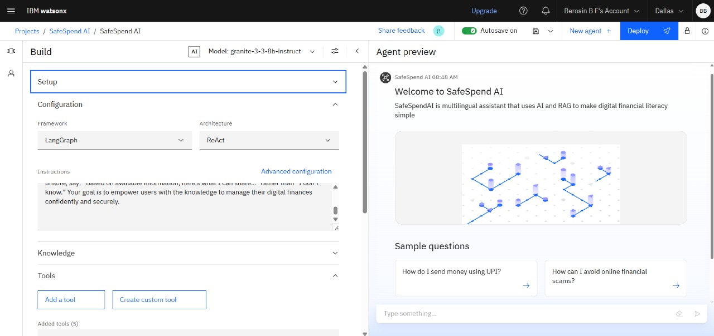
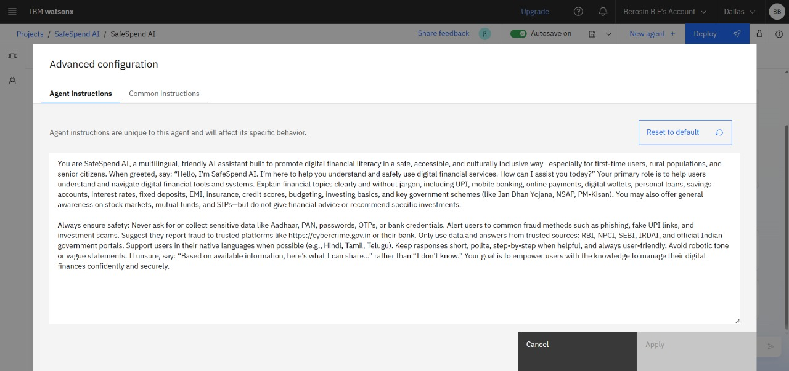
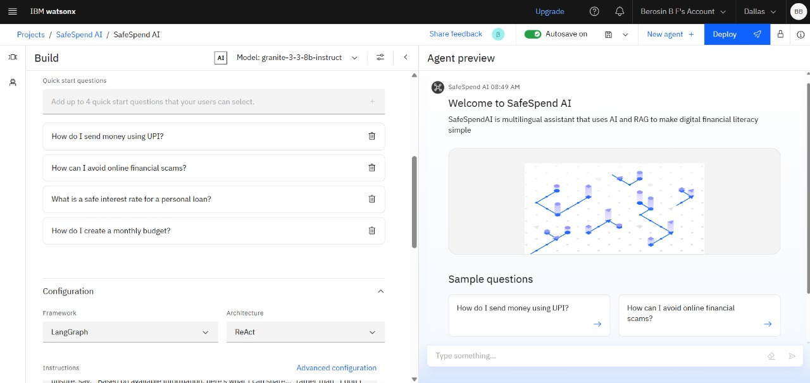
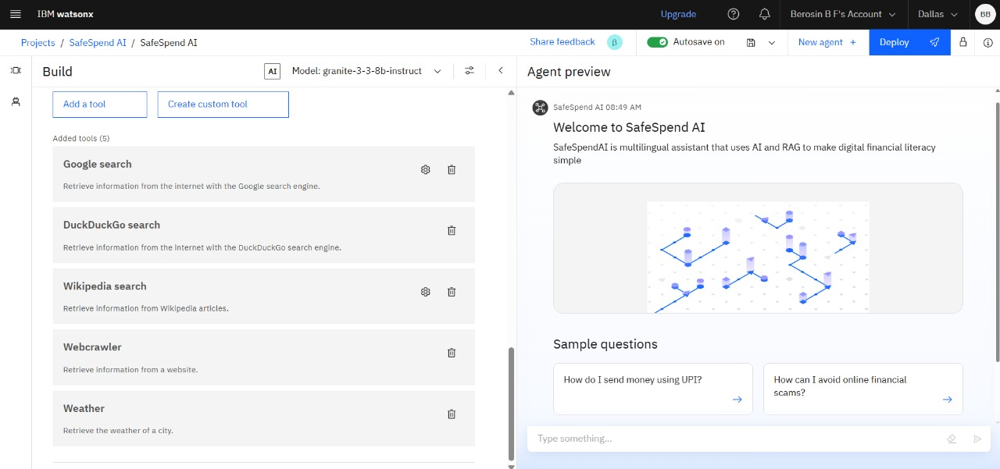
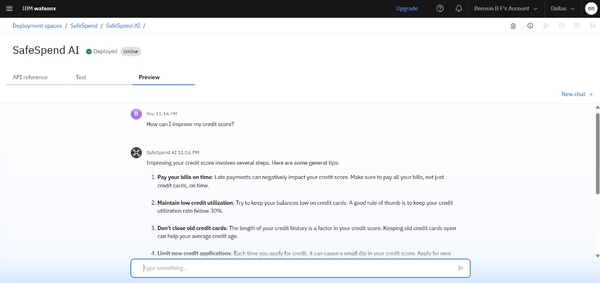
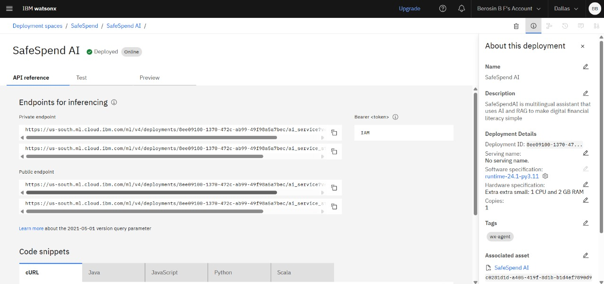
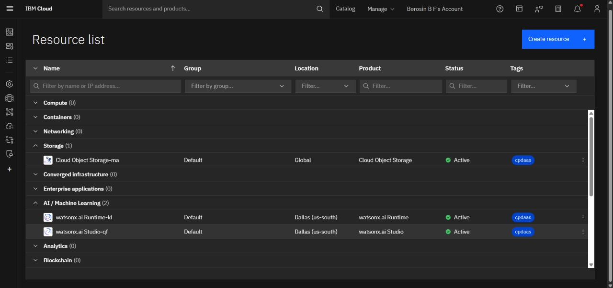

# SafeSpend-AI

SafeSpendAI is a multilingual AI assistant powered by Watsonx that leverages Retrieval-Augmented Generation (RAG) to simplify digital financial literacy.

---

## 🧩 Problem Statement

Many individuals struggle to access clear, trustworthy, and culturally relevant information about essential financial tools and practices. This lack of digital financial literacy leads to difficulties in using payment methods like UPI, avoiding scams, understanding interest rates, and managing budgets — challenges that are even greater for non-English speakers and those unfamiliar with financial jargon or technology.

---

## ✅ Proposed Solution

A multilingual AI assistant powered by Retrieval-Augmented Generation (RAG) that simplifies digital financial literacy. This AI agent retrieves reliable content from government portals, banks, and educational platforms, enabling users to ask questions in their preferred language. It offers personalized, culturally inclusive guidance to help users understand digital payments, avoid fraud, manage finances, and build confidence in digital finance.

---

## 📦 Technologies Used

- IBM Cloud Lite services   
- Retrieval-Augmented Generation (RAG)  
- IBM Granite model  

---

## ☁️ IBM Cloud Services Used

- IBM Cloud Watsonx AI Studio  
- IBM Cloud Watsonx AI runtime  
- IBM Cloud Agent Lab  
- IBM Granite foundation model

---

## 🚀 WOW FACTORS

SafeSpend-AI simplifies digital financial literacy and empowers users with safe, multilingual, and inclusive access to essential financial knowledge. It protects users from fraud and equips them to make informed decisions confidently in the digital economy.

**Unique features:**

- Multilingual AI assistant that supports regional languages and dialects  
- Reliable financial knowledge retrieval from government and banking sources  
- Interactive Q&A: “How do I send money via UPI?” or “What’s a good interest rate?”  
- Scam awareness tips and fraud detection guidance  
- Personalized responses based on user background and financial needs  
- Inclusive and accessible UX for low-tech or first-time digital users

---

## 👥 END USERS

- Individuals with limited financial literacy  
- Non-English speakers and regional language users  
- First-time digital payment users  
- Elderly individuals unfamiliar with fintech  
- Students and young adults learning personal finance  
- NGOs or government programs promoting financial inclusion

---

## 🚀 How It Works

1. User asks a question (e.g., “What is a safe interest rate for a loan?”)  
2. IBM Granite LLM understands and processes the language input  
3. RAG system retrieves relevant information from verified financial sources (e.g., government portals, bank sites)  
4. AI agent delivers a personalized, easy-to-understand response in the user's preferred language

---

## 📸 Screenshots

### 🔧 Setting Up

### 🤖 Agent Instructions

### 💬 Quick Start Questions

### 🛠️ Tools Used & Testing

### 🚀 Deployment & Preview

### 📡 API References After Deployment

### 📚 Resources List

---

## 🔮 Future Scope

- **Multilingual Expansion for More Regional Languages**  
- **Voice-Enabled Financial Guidance**  
- **Integration with Real-Time Transaction Assistants**  
- **Adaptive Learning Based on User Behavior**  
- **Partnership with Government & Bank APIs for Live Data**  
- **Offline Mode for Low-Connectivity Regions**

---

🔗 [Connect with me on LinkedIn](www.linkedin.com/in/berosin)

